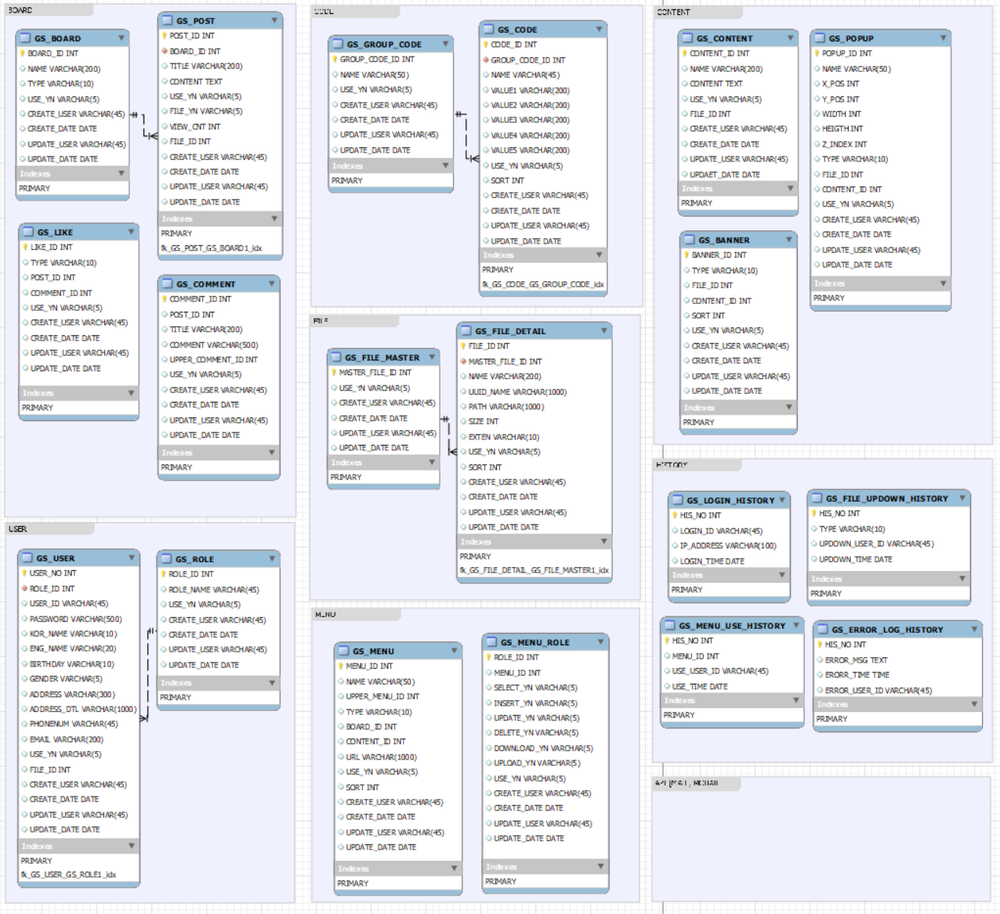

# CMS_SpringBoot_Mybatis_Vue

풀스택으로 혼자 진행한 CMS(Content Mangement System) 프로젝트

회사에서 항상 Spring legacy 및 OracleDB만 사용하여
Spring Boot MySQL를 사용해보고자 시작한 프로젝트

## Stack

### Front 
- HTML
- CSS
- JavaScript
  - Vue3
  - VueRouter
  - Pinia
  - Axios
  - TypeScript
  - Vuetity
  - React(추후 따로 구성할지 고민중)

### Back
- Java11
- SpringBoot2.7
  - Swagger
  - Spring Security
  - Log4j2
  - JWT
  - MyBatis
  - MySQL
  - RestApi
  - Transcation
  - Interceptor
  - Aop
  - lombok
  
### 기타
 - Apache / Tomcat
 - Npm
 - IntelliJ IDE
 - Jenkins
 - Docker
 
 - AWS (결재 만료로 서버 다시 개설 해야 해서 고민중)
 - nginX (고민중)
 
## ERD

## CI/CD, Server 구성

## Api

### Common Api
 - File
 - User
 - Role
 - Menu
 - MenuRole
 - Code

### CMS Api
 - Board
 - Post
 - Content
 - Comment
 - Like
 - Banner
 - Popup
 
### History Api
 - LoginHistory
 - FileUpDownHistory
 - MenuUseHistory
 
